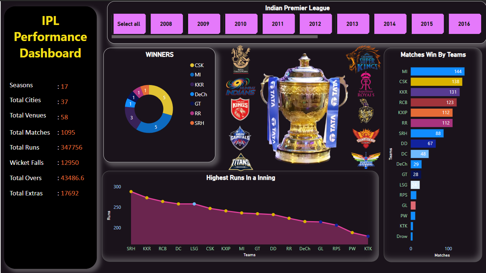
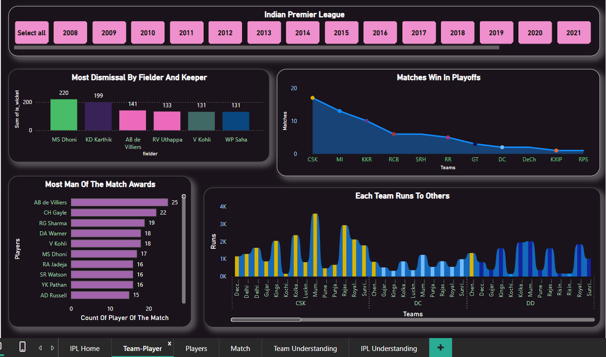

# IPL-PowerBI-Analysis

This project delivers an interactive and insightful analysis of IPL (Indian Premier League) data using Power BI. From raw match statistics to refined visual storytelling, the dashboard reveals patterns in team performances, player metrics, venue impacts, and seasonal trends across 13 IPL seasons (2008–2020).

---

The IPL generates rich cricketing data every season, but extracting actionable insights from it at scale is challenging. This project aims to:
- Understand team strengths, weaknesses, and consistency over years
- Identify top players by runs, wickets, strike rate, and economy
- Analyze how toss and venue impact match outcomes
- Create a professional dashboard for exploratory cricket analytics

---

## 🚀 Project Goals

| Goal # | Description |
|--------|-------------|
| ✅ 1 | Perform data cleaning, transformation, and modeling using Power BI |
| ✅ 2 | Build interactive and user-friendly dashboards |
| ✅ 3 | Enable drilldowns by team, season, player, and venue |
| ✅ 4 | Apply DAX formulas to create KPIs and dynamic insights |
| ✅ 5 | Demonstrate storytelling with visuals for analytics hiring portfolios |

---

## 💸 Business & Investment Relevance

While primarily built for cricket analytics, this dashboard also serves as a valuable tool for **investors, sponsors, and sports business analysts**:

- 📈 **Franchise Performance Tracking**  
  Evaluate a team's win/loss trends across seasons to assess consistency — useful for long-term investment or sponsorship decisions.

- 👥 **High-Impact Player Monitoring**  
  Identify key players whose performance significantly influences match outcomes. This is helpful in:
  - Player acquisition strategy
  - Fantasy league predictions
  - Endorsement and brand alignment decisions

- 🏟️ **Venue & Fan Engagement Trends**  
  Analyze which teams perform better in high-attendance venues or metro cities — supporting **location-based marketing and ROI-based sponsorship planning**.

- 📊 **Data-Driven Decision-Making for Team Investment**  
  Much like evaluating stock performance, team consistency and upward performance trends can guide potential:
  - Franchise or league investments
  - Brand sponsorship deals
  - Fantasy league platform metrics
  - Strategic player portfolio planning

> This makes the dashboard relevant not just for cricket enthusiasts, but also for **finance analysts, sports marketers, startup investors, and media strategists** operating in the IPL ecosystem.

## 📂 Dataset Source
This project uses publicly available IPL data from Kaggle:  
[IPL Dataset on Kaggle](https://www.kaggle.com/datasets/ashraykothari/ipldataset)

To use this Power BI dashboard:
1. Download the dataset
2. Place the file inside this `/data` folder
3. Open `IPL_Analysis.pbix` and refresh the data source

## 📊 Dashboard Features

| Feature                      | Description |
|-----------------------------|-------------|
| 🧠 **Overview Page**        | High-level summary of IPL matches, wins, and key metrics |
| 🧑‍🤝‍🧑 **Team Performance** | Compare total wins, toss impact, win % by season and venue |
| 🧍 **Player Insights**      | Top batsmen, bowlers, strike rates, economy, etc. |
| 🏟️ **Venue Analysis**       | Home vs away win rates, venue-based performance heatmaps |
| 🔍 **Dynamic Filters**      | Interactive slicers by team, player, season, venue, match outcome |
| 🔢 **Custom KPIs**          | Win ratio, average score, toss impact percentage, etc. via DAX |
| 🔄 **Drillthrough Support** | Deep dives into individual matches or players |

---

## 📌 Visual Examples

### 📷 Dashboard Preview 1: Overall Match Insights

### 📷 Dashboard Preview 2: Top Players Comparison

---

## 🛠️ Tools & Technologies Used

| Tool / Language   | Purpose |
|-------------------|---------|
| Power BI Desktop  | Data visualization, report building |
| Power Query       | Data transformation, merging, filtering |
| DAX               | Custom KPIs, calculated measures |
| Excel / CSV       | Raw data input from Kaggle |
| GitHub            | Version control and project hosting |

---

## 👩‍💻 Author
**Dhruvi Ranwala**

🎓 Aspiring Analytics & AI Professional | 📊 Power BI | 🧠 ML & NLP

🔗 [LinkedIn](https://www.linkedin.com/in/dhruvi-ranwala-596b32233/) | 📁 [GitHub Portfolio](https://github.com/dhruvii-i)
